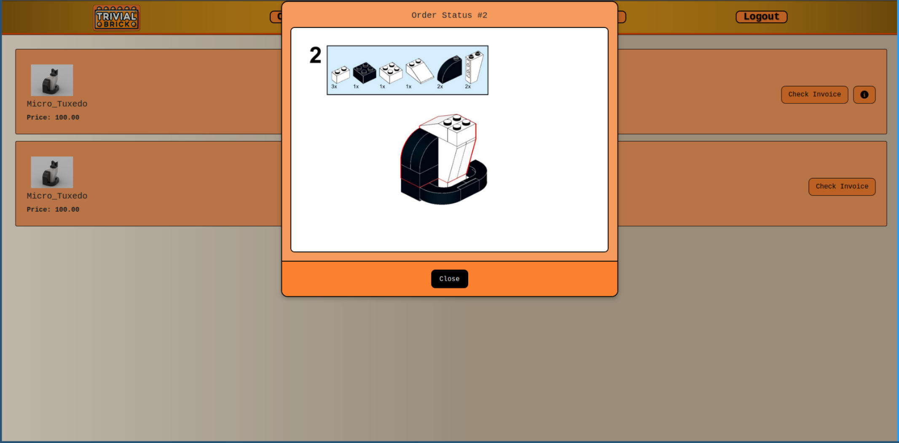

<!-- PROJECT LOGO -->
<br />
<div align="center">
  <a href="https://github.com/darguima/Trivial-Brick-LI4">
    
  </a>

  <h3 align="center">Trivial Brick LI4</h3>

  <p align="center">
    LI4 Project – E-shop and management system for Trivial Brick, a seller of pre-assembled Lego sets.
    <br />
    <br />
    <a href="#-demo">View Demo</a>
    &middot;
    <a href="#-getting-started-with-development">Start Developing</a>
  </p>

<h4 align="center">
⭐ Don't forget to Starring ⭐
</h4>

  <div align="center">

[![C#][CSharp-badge]][CSharp-url]
[![.NET][DotNet-badge]][DotNet-url]
[![MSSQL][MSSQL-badge]][MSSQL-url]

  </div>

  <div align="center">

![University][university-badge]
![Subject][subject-badge]
![Grade][grade-badge]

  </div>
</div>


<!-- TABLE OF CONTENTS -->
<details>
  <summary>📋 Table of Contents</summary>

## 📋 Table of Contents

- [About The Project](#-about-the-project)
- [Usage](#-usage)
- [Getting Started with Development](#-getting-started-with-development)
- [Contributing](#-contributing)
- [Developed by](#-developed-by)
</details>


## 🔍 About The Project

### 🎯 The goal

The project challenge was to develop a platform for a company with assembly lines, where the assembled product could be freely chosen. The system had to include, at minimum, stock management and real-time visualization of the assembly process.

Our team created the concept of Trivial Brick, a fictional company that sells pre-assembled Lego sets. We designed a full e-shop and management system, including features for stock control, production line monitoring, order handling, and a real-time view of product assembly.

### ⚙️ How it works?

The solution was implemented using .NET for the backend and MS SQL Server for data persistence. The project follows a layered architecture divided into Data, Business, and UI layers, promoting separation of concerns and maintainability.

The Data layer handles database access and entity mapping, the Business layer contains the core logic for managing stock, production lines, and orders, and the UI layer provides interfaces for both administrators and clients. This structure allows smooth coordination between real-time assembly tracking, order processing, and system management.

### 🎬 Demo

https://github.com/user-attachments/assets/78010aa9-616c-42fc-99f1-5bc43e8f5e59




### 🧩 Features

* Create products using a structured ZIP file.

* Python script generates ZIP from real Lego assembly PDF.

* Real-time assembly tracking.

* Admin interface for stock and order management.

* Customer e-shop for browsing and placing orders.


## 📖 Usage

### Admin

You can login with the following credentials:

```
# Admin credentials
Username: admin@TrivialBrick.pt
Password: admin
```

Inside you can create products using a structured ZIP file. The Python script in the `products_scraper` folder generates the ZIP from real Lego assembly PDF. Read the [products_scraper/README.md](products_scraper/README.md) for more information. You can also use the `products_scraper/output_example.zip` as an example.

Everything else is very intuitive, you can manage stock, assembly lines and check real-time assembly tracking just by clicking on the buttons.

## 🚀 Getting Started with Development

To get a local copy up and running follow these simple example steps.

### 1. Prerequisites

Start by installing the following tools:

* [Git](https://git-scm.com/downloads) - Version Control System
* [dotnet sdk 8](https://dotnet.microsoft.com/en-us/download/dotnet/8.0) - .NET SDK 8.0
* [aspnet runtime 8](https://dotnet.microsoft.com/en-us/download/dotnet/8.0) - ASP.NET Runtime
* [docker](https://www.docker.com/get-started) - Containerization Platform
* [mssql-tools](https://docs.microsoft.com/sql/linux/sql-server-linux-setup-tools) - SQL Server Command Line Tools

```bash
# On Arch Linux you can run the following command
$ yay -S dotnet-sdk-8.0 aspnet-runtime-8.0 docker mssql-tools
```

### 2. Cloning

Now clone the repository to your local machine. You can do this using Git:

```bash
$ git clone https://github.com/darguima/Trivial-Brick-LI4.git
# or
$ git clone git@github.com:darguima/Trivial-Brick-LI4.git
```

### 3. Setting up the database

To create the database, run the following command:

```bash
$ docker-compose up -d
```

Now, to create the tables and insert the data use the following command. At the end, you should see - "Everything is ready!"

```bash
$ sqlcmd -S 127.0.0.1,1433 -U sa -P PAss++00 -i setup.sql -No
```

### 4. Running the project

```bash
$ docker-compose up -d # Start the database
$ dotnet run # Run the project
$ dotnet watch run # Run the project with hot reload
$ dotnet format Trivial-Brick-LI4.sln # Format the code
```

Now just open your browser and go to `http://localhost:5172`. If you want some information about how to use the application, you can check the [Usage](#-usage) section above.


## 🤝 Contributing

Contributions are what make the open source community such an amazing place to learn, inspire, and create. Any contributions you make are **greatly appreciated**.

If you have a suggestion that would make this better, please fork the repo and create a pull request. You can also simply open an issue with the tag "enhancement".
Don't forget to give the project a star! Thanks again!

1. Fork the Project
2. Create your Feature Branch (`git checkout -b feature/AmazingFeature`)
3. Commit your Changes (`git commit -m 'Add some AmazingFeature'`)
4. Push to the Branch (`git push origin feature/AmazingFeature`)
5. Open a Pull Request


## 👨‍💻 Developed by

- [Afonso Pedreira](https://github.com/afooonso)
- [Dário Guimarães](https://github.com/darguima)
- [Hugo Rauber](https://github.com/HugoLRauber)
- [Rodrigo Macedo](https://github.com/rmufasa)


<!-- MARKDOWN LINKS & IMAGES -->
<!-- https://www.markdownguide.org/basic-syntax/#reference-style-links -->
[project-thumbnail]: ./readme/logo.png

[university-badge]: https://img.shields.io/badge/University-Universidade%20do%20Minho-red?style=for-the-badge
[subject-badge]: https://img.shields.io/badge/Subject-LI4-blue?style=for-the-badge
[grade-badge]: https://img.shields.io/badge/Grade-14%2F20-brightgreen?style=for-the-badge

[CSharp-badge]: https://img.shields.io/badge/C%23-239120?style=for-the-badge&logo=c-sharp&logoColor=white
[CSharp-url]: https://learn.microsoft.com/en-us/dotnet/csharp/

[DotNet-badge]: https://img.shields.io/badge/.NET-512BD4?style=for-the-badge&logo=dotnet&logoColor=white
[DotNet-url]: https://dotnet.microsoft.com/

[MSSQL-badge]: https://img.shields.io/badge/MSSQL-CC2927?style=for-the-badge&logo=microsoftsqlserver&logoColor=white
[MSSQL-url]: https://www.microsoft.com/en-us/sql-serve
